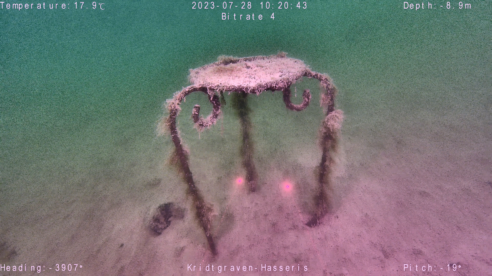

## Underwater Image Enhance
  

This repository contains code that enhance underwater images without machine learning using color correction and contrast adjustment techniques such as CLAHE and color compensation.
Any kind of machine learning was out of scope for this project and might be used in the future. The usage for these scripts are calibrated for danish water environments that are muddy, cloudy and 
contains dense amounts of marine snow unlike tropical waters that are often used in underwater image enhancement projects.

## Result Examples
 

## Dependencies
The scripts for this repository was made on the following depencies that you should have on the listed version or higher:

\
\
\

## Contributors
This project was developed by group 363 on Aalborg University Robotics third semester.

<section id="sec_contributors">
<table>
  <tr> 
    <td align="center"><a target="_blank" rel="noreferrer noopener" href="https://github.com/emilskall"> <b>Emil Skall</b></a> <a href="gttps://github.com/emilskall" title="">😈</a></td>
    <td align="center"><a target="_blank" rel="noreferrer noopener" href="https://github.com/nicopiko"> <b>Nicolai Stallknecht</b></a> <a href="gttps://github.com/nicopiko" title="">💀</a></td>
    <td align="center"><a target="_blank" rel="noreferrer noopener" href="https://github.com/frozone11"> <b>Frozone11</b></a> <a href="gttps://github.com/frozone11" title="">👽</a></td>
    <td align="center"><a target="_blank" rel="noreferrer noopener"  href="https://github.com/Gustav-Bay"> <b>Gustav Bay</b></a> <a href="gttps://github.com/Gustav-Bay" title="">😎</a></td>
    <td align="center"><a target="_blank" rel="noreferrer noopener" href="https://github.com/molingo"> <b>molingo</b></a> <a href="gttps://github.com/molingo" title="">🇵🇱</a></td>
    <td align="center"><a target="_blank" rel="noreferrer noopener" href="https://github.com/nikobk"> <b>Nikolaj Bjørnager Krebs</b></a> <a href="gttps://github.com/nikobk" title="">🤠</a></td>
  </tr>
</table>
